<!DOCTYPE html>
<!-- <html lang="en">
 --><head>
<!--     <meta charset="UTF-8">
    <meta name="viewport" content="width=device-width, initial-scale=1.0">
    <title>ECOMERCE-EN-LARAVEL</title> -->

</head>
<body>
    

        <h1 align="center">PETITION WEBSITE</h1>
        
This is a petition management website with email validation and social media sharing. Users have the option to comment, sign, and share with their contacts. A petition is considered complete when it reaches the predefined goal.

      <h2 align="center">Connect with me</h2>

  
  
  

    

 

| Image  |
|---------|
| 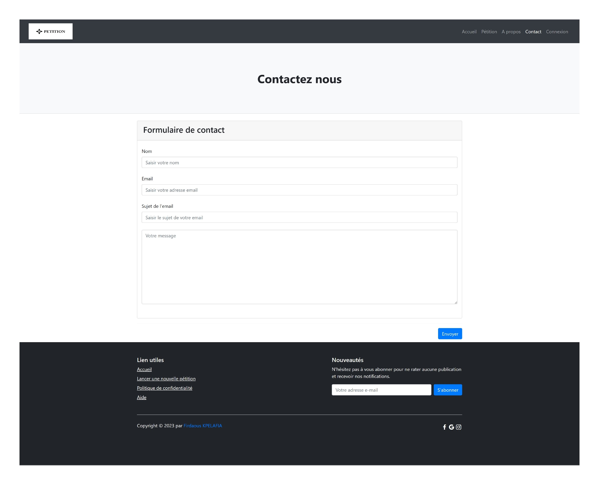 |

| Image  |
|---------|
|  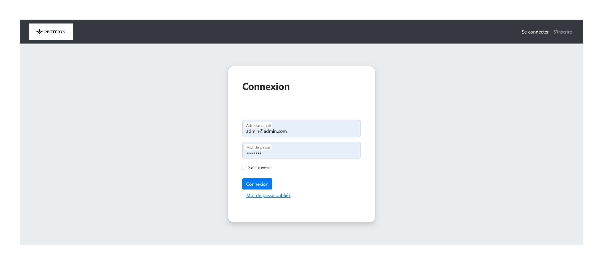 |

| Image  |
|---------|
|   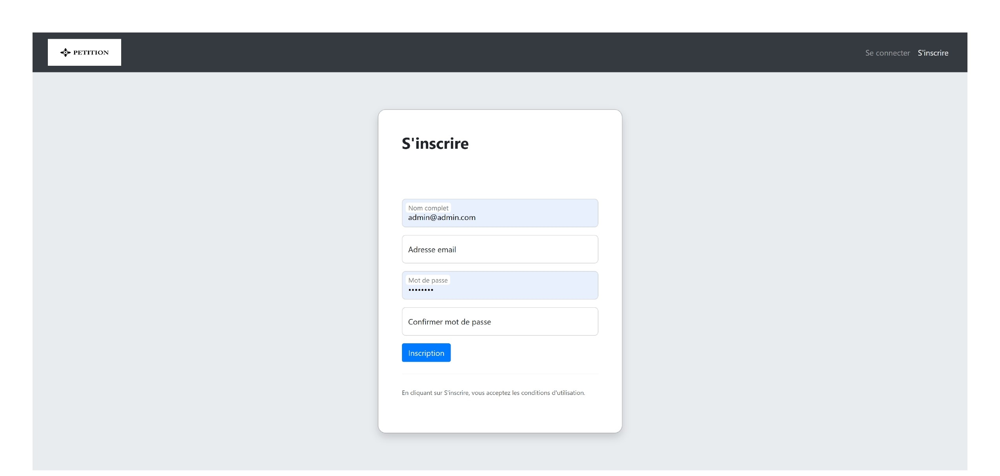|

| Image  |
|---------|
|  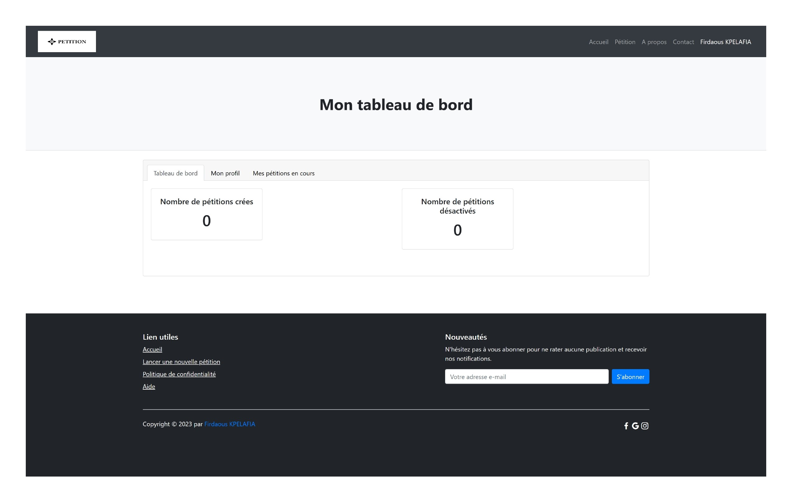 |

| Image  |
|---------|
|  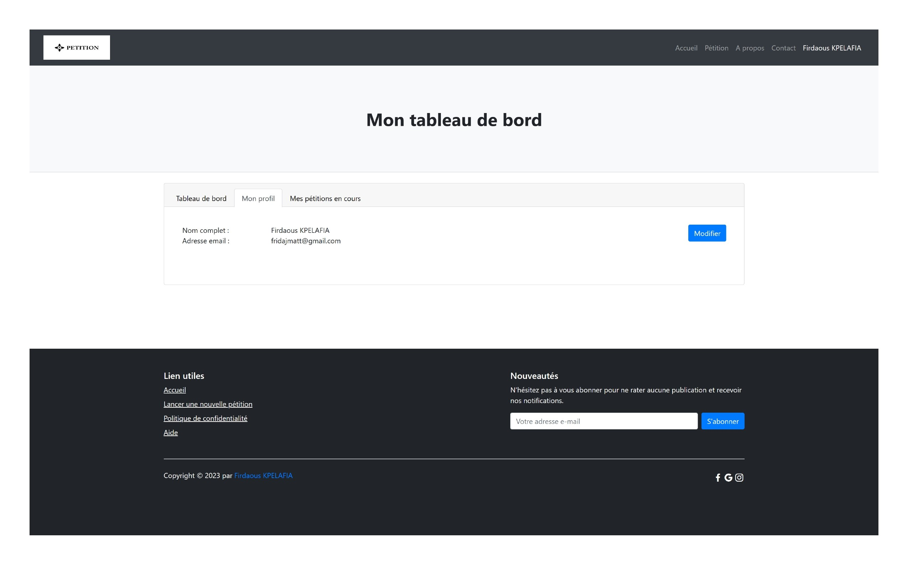 |

| Image  |
|---------|
|  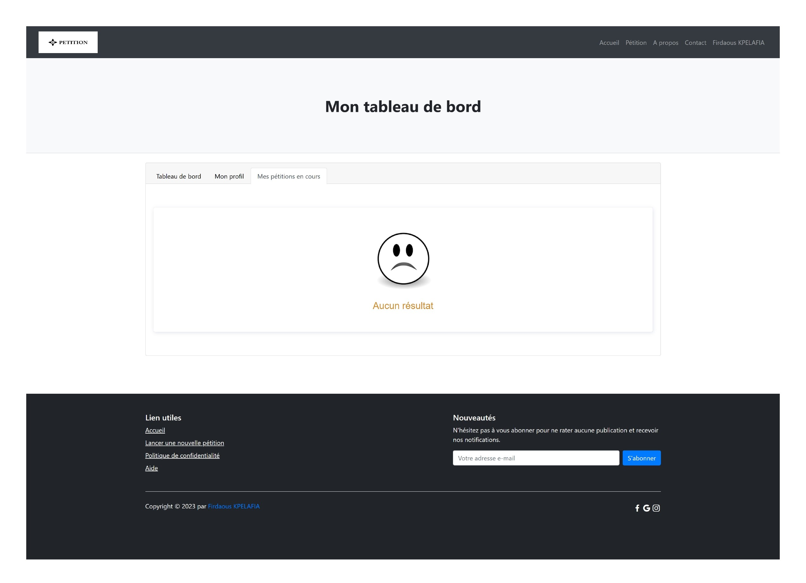 |

| Image  |
|---------|
|  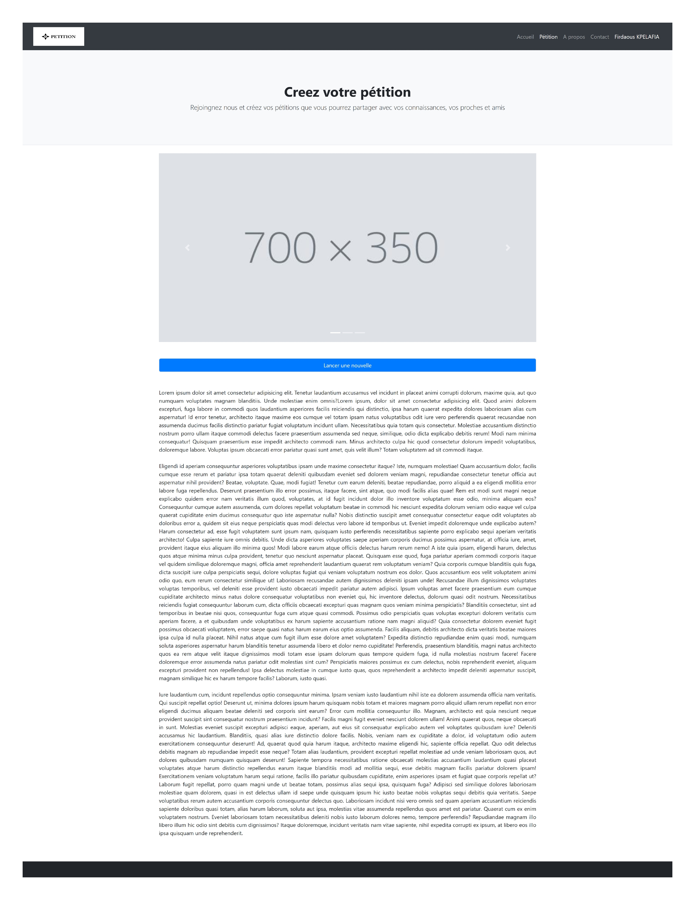 |

| Image  |
|---------|
|  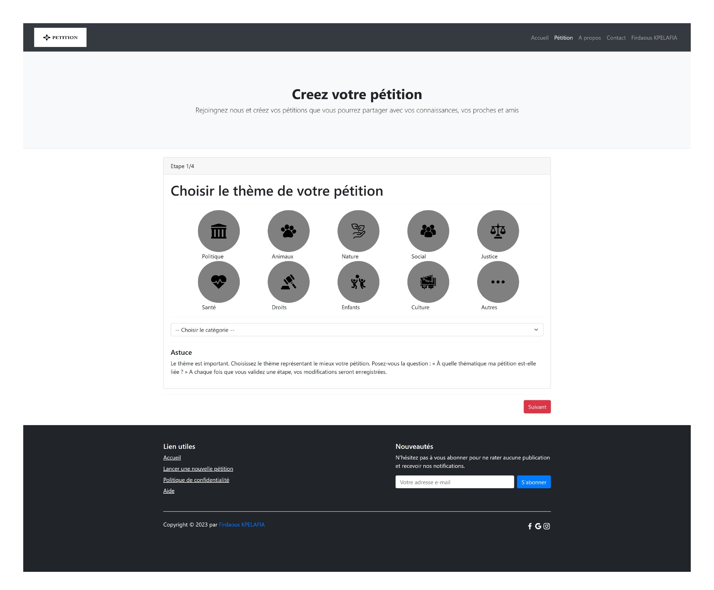 |

| Image  |
|---------|
|  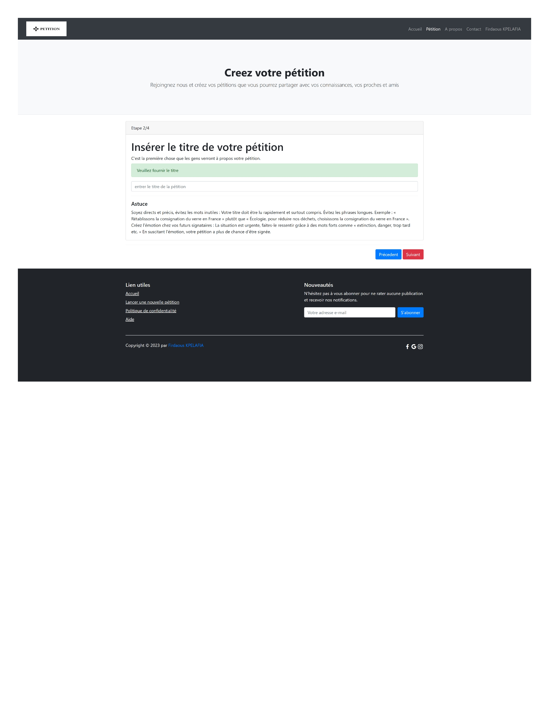 |

| Image  |
|---------|
|   |

| Image  |
|---------|
|  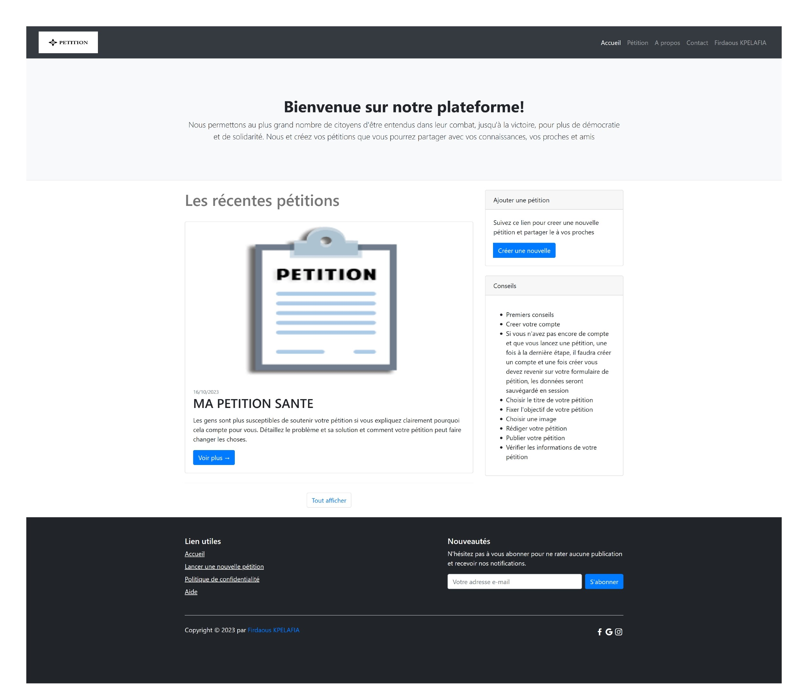 |

| Image  |
|---------|
|  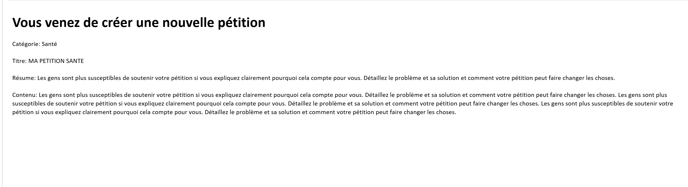 |

| Image  |
|---------|
|  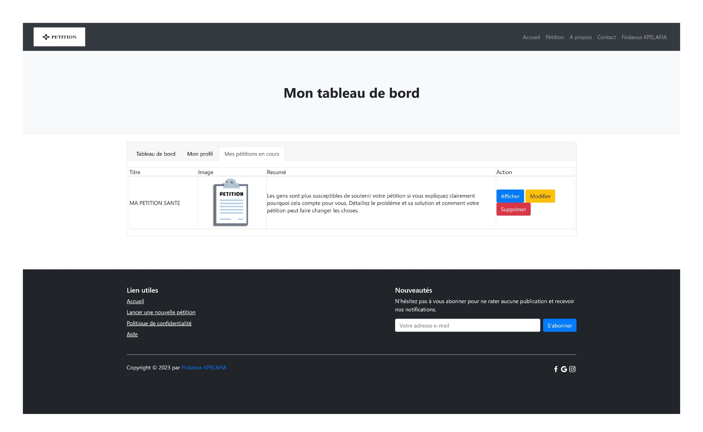 |

| Image  |
|---------|
|  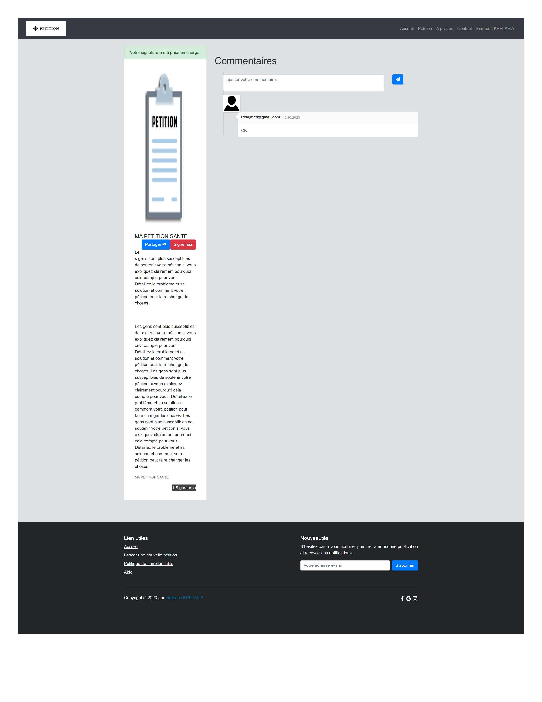 |

</body>
</html>
